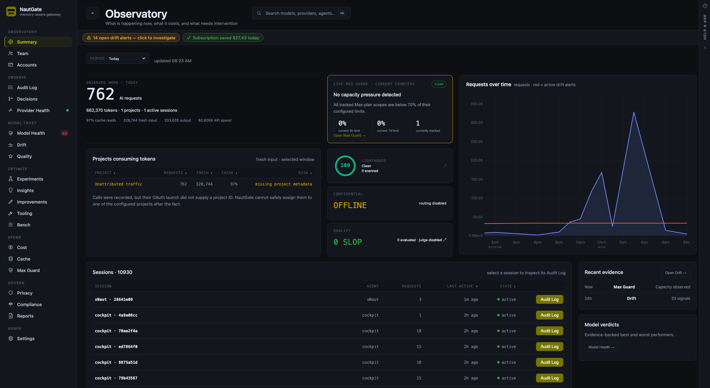
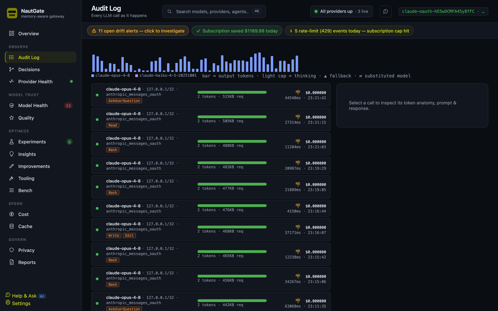
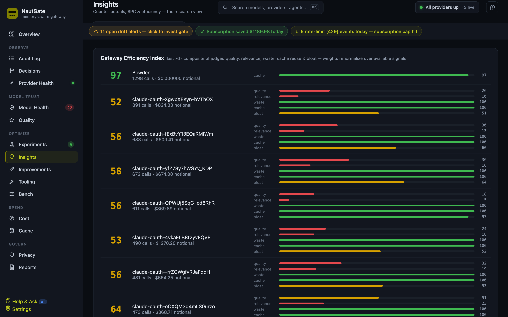
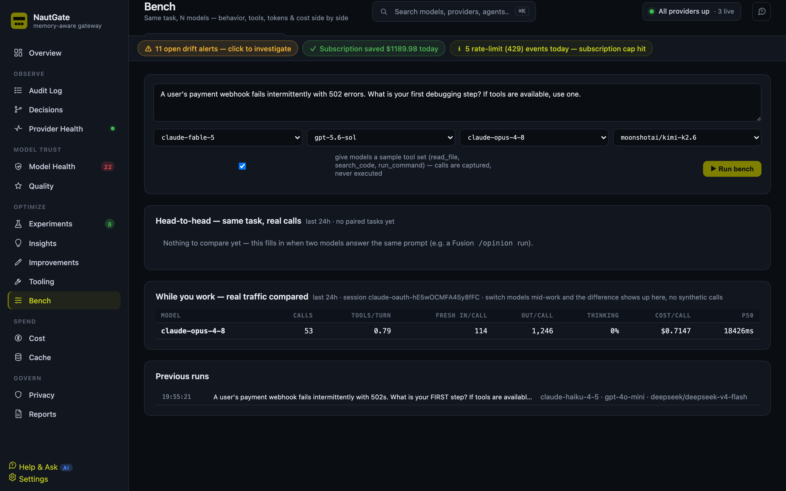
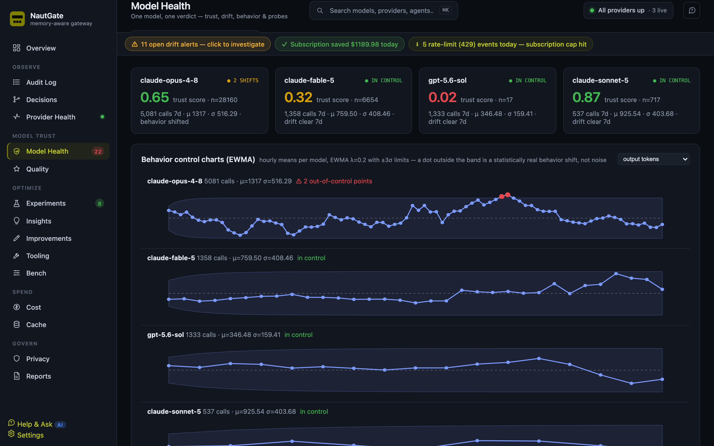

# NautGate

[](https://github.com/48Nauts-Operator/NautGate/actions/workflows/ci.yml)
[](LICENSE)
[](https://docs.nautgate.dev)
[](https://github.com/48Nauts-Operator/NautGate/releases)

> One gateway for every LLM call — routed, measured, and provably logged.

NautGate sits between your coding agents and every model provider. Claude Code,
Codex, Pi and your own apps point at one endpoint; NautGate routes each call,
records what actually happened, and tells you what it cost.

The point isn't routing — plenty of tools route. The point is **evidence**: for
every call you can prove which model really answered, what data it saw, how long
it took and what it cost.

```
Claude Code ─┐
Codex ───────┤                      ┌─ Anthropic
Pi ──────────┼──► NautGate :8090 ───┼─ OpenAI
your app ────┘     │                ├─ OpenRouter
                   │                └─ LM Studio / local
                   └──► Postgres (audit, outcomes, analytics)
```

<p align="center">
  
  <br><sub>The Observatory — operational usage, token-consuming projects, live risk, quality, drift, and sessions in one evidence-backed view.</sub>
</p>

## Why

Ask a model which model it is and it tells you whatever its client's system
prompt says. Claude Code asserts an identity in every request, so a routed model
answers "I am Claude" no matter what generated the tokens. Self-report is
worthless.

NautGate reads the model name from the **provider's own response**, never from
the request — so the audit log is attested rather than assumed. That one
property is what makes cost attribution, substitution detection and compliance
reporting trustworthy.

## Features

**Gateway**
- OpenAI-compatible (`/v1/chat/completions`) and Anthropic-compatible (`/v1/messages`) inbound
- Two credential lanes: OAuth subscription traffic passes through untouched and free; metered keys get routed
- Per-key model override — pin any model to an API key and run Claude Code on it
- Local models via LM Studio, addressable as `lmstudio/<id>`
- Fail-closed confidential routing — send PII/secrets to a Settings-selected local model with no cloud fallback

**Evidence**
- Full audit log: policy-gated prompt/response capture, tokens, timings, cost
- Routing flow view — client → lane → decision → upstream → model actually served
- Silent-substitution detection when the served model differs from the requested one
- Sensitivity classification (PII/secrets) before anything is stored
- Deterministic Swiss/EU PII detection through Bowden, with matched values redacted from audit captures

**Analytics**
- Observatory summary, team, and account views for operational usage at a glance
- Max Guard for Claude Max fresh-input, cache, session, and rolling-window pressure
- Quality gate — post-hoc judge scoring with failure-mode buckets
- Head-to-head — real calls grouped by task, so models compare like-for-like
- Champion/challenger shadow testing with a blind judge
- Tooling — what your MCP servers cost in carried schema vs what they save
- Cache accounting, context-bloat detection, drift and behavioural control charts
- Cost by project/agent/model, plus notional subscription savings

## Screenshots

<table>
  <tr>
    <td width="50%"><br><sub><b>Audit log</b> — every call, attested and policy-gated</sub></td>
    <td width="50%"><br><sub><b>Insights</b> — what the gateway learned from your traffic</sub></td>
  </tr>
  <tr>
    <td><br><sub><b>Head-to-head</b> — models compared on the tasks you actually run</sub></td>
    <td><br><sub><b>Model health</b> — drift and behavioural control charts</sub></td>
  </tr>
</table>

## Install

### Docker — full stack (recommended on macOS and Linux)

Requires Docker with Compose v2. Pull the published stack — no clone, no build:

```bash
curl -fsSL https://nautgate.dev/compose.yml -o docker-compose.yml
docker compose up -d

# NautGate mints a first-run API key on first boot — grab it from the log:
docker compose logs nautgate | grep -oE 'ng_[a-f0-9]{32}_[A-Za-z0-9_-]+' | head -1
```

Grab it before recreating the container: the key is minted **only when the
database has no keys yet**, so `docker compose logs` on a rebuilt container will
not show it again, and minting a new one needs a key you already have. Locked
out? Set `NAUTGATE_LOCAL_ADMIN_TOKEN` in your `.env` and restart — the dashboard
then authenticates with it, and you can mint a fresh key from **Settings → Keys**.

Paste that key into the dashboard to activate it, then add your model-provider
keys in **Settings → Providers** (encrypted at rest — no `.env` or master key to
configure). Prefer files? Set `OPENROUTER_API_KEY`, `ANTHROPIC_API_KEY`, … in a
`.env` next to the compose instead. Building from source? See [Development](#development).

**Update Docker:** `docker compose pull && docker compose up -d` pulls the latest
image and recreates — your data (DB volume) is kept.

### Homebrew — native gateway (macOS)

Homebrew installs the gateway without Docker. PostgreSQL is a dependency but
its database needs to be created once:

```bash
brew install 48nauts-operator/tap/nautgate
brew services start postgresql@16
"$(brew --prefix postgresql@16)/bin/createdb" nautgate
brew services start nautgate

# Copy the first-run key printed on the initial start:
grep -oE 'ng_[a-f0-9]{32}_[A-Za-z0-9_-]+' \
  "$(brew --prefix)/var/log/nautgate.log" | head -1
```

Check it with `nautgate status`, then open
<http://127.0.0.1:8090/dashboard>. The service binds to loopback by default.

The formula installs the native NautGate core, not the NautRouter sidecar.
Direct provider and passthrough traffic works; `model: auto` and tier routing
need a separately running NautRouter. Use Docker above when you want the complete
stack with routing included.

**Update Homebrew:** `brew update && brew upgrade nautgate`.

### Connect a client

Point a client at it:

```bash
# OpenAI-compatible
export OPENAI_BASE_URL=http://localhost:8090/v1
export OPENAI_API_KEY=ng_…      # mint one in Settings → Keys

# Claude Code with a NautGate key
ANTHROPIC_BASE_URL=http://localhost:8090 ANTHROPIC_API_KEY=ng_… claude
```

Do not add `--bare` merely to make NautGate work. It changes Claude Code's
normal authenticated launch behavior and can cause a login loop in setups that
expect the stored Claude session. xNaut integrations should use NautGate's
native launch endpoint so Max Guard receives the application, project, run, and
native-session identity without replacing Claude Code's own login flow.

Dashboard: <http://localhost:8090/dashboard>

## Layout

```
core/         FastAPI gateway (Python 3.12, uv)
vendor/       NautRouter — scoring + format translation (TypeScript)
deploy/       docker-compose stack
config/       routing + pricing tables
extensions/   optional capture / brain / privacy sidecars
scripts/      operational scripts
```

## Development

```bash
just test     # pytest
just lint     # ruff check
just fix      # ruff check --fix && ruff format
just dev      # uvicorn --reload
just up/down  # docker compose
```

## Status

Actively developed and in daily use, but **pre-1.0** — schema and endpoints can
still change between releases. Endpoints that aren't implemented yet return
`501` with an `X-Nautgate-Coming-In` header rather than 404.

## Contributing

Issues and PRs welcome — see [CONTRIBUTING.md](CONTRIBUTING.md). Start with
[`good first issue`](https://github.com/48Nauts-Operator/NautGate/labels/good%20first%20issue).

Found a security problem? Please don't open a public issue — see
[SECURITY.md](SECURITY.md).

## License

Copyright © 2026 André Wolke, 48Nauts. NautGate is licensed under
[AGPL-3.0-or-later](LICENSE). Use, modify and self-host it freely. If you run a
modified version as a network service, the AGPL requires you to offer its
corresponding source to users of that service.

A separate commercial license is available for anyone who wants NautGate without
AGPL obligations — <hello@48nauts.com>. Contributions are accepted under the
terms in [CONTRIBUTING.md](CONTRIBUTING.md#contributor-license-agreement), which
is what makes that dual-licensing possible.
